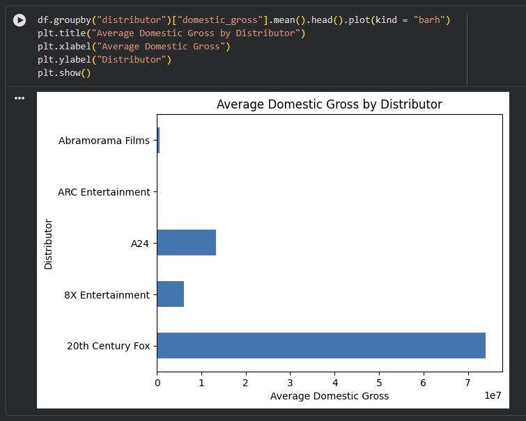
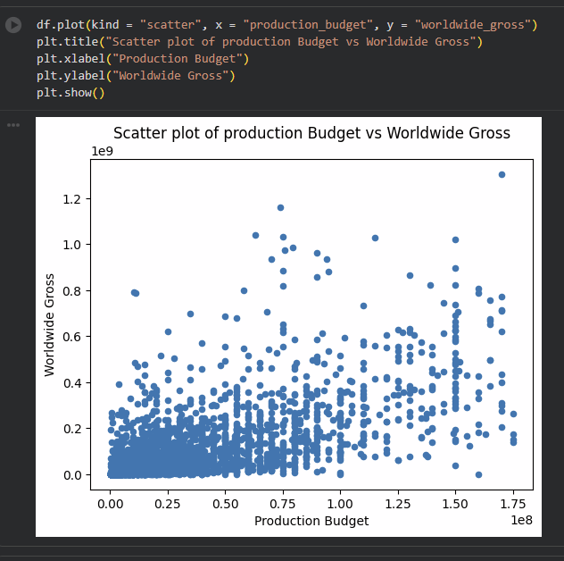
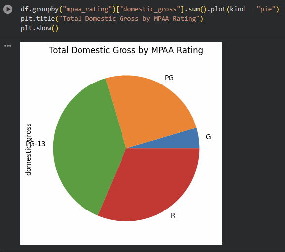

# movie-profit-eda
Movie profit analysis using EDA in Python

# 🎬 Movie Profit Analysis (EDA Project)

## 📌 Project Overview
This project performs **Exploratory Data Analysis (EDA)** on a movie dataset to understand the key factors influencing movie profitability.

The analysis focuses on identifying patterns between budget, revenue, and genres to uncover insights about what makes a movie successful.

---

## 📂 Dataset
- Source: Kaggle
- The dataset includes:
  - Budget
  - Revenue
  - Genre
  - Movie-related attributes

---

## 🛠️ Tools & Technologies Used
- Python 🐍
- Pandas
- NumPy
- Matplotlib
- Seaborn
- Jupyter Notebook / Google Colab

---

## 📊 Key Analysis Performed
- Data Cleaning and Handling Missing Values
- Profit Calculation (Revenue - Budget)
- Exploratory Data Analysis (EDA)
- Visualization of trends and relationships
- Genre-based analysis

---

## 📈 Visualizations

### Budget vs Revenue Relationship


### Genre-wise Profit Analysis


### Distribution of Revenue / Profit


---

## 🔍 Key Insights
- Movies with higher budgets tend to generate higher revenue, but not always higher profit
- Certain genres consistently perform better in terms of profitability
- There is a wide variation in revenue distribution, indicating unpredictable movie success
- Some low-budget movies achieve high profit margins

---

## ▶️ How to Run
1. Clone the repository
2. Open the notebook:
   ```bash
   MOVIEPROFITS.ipynb
